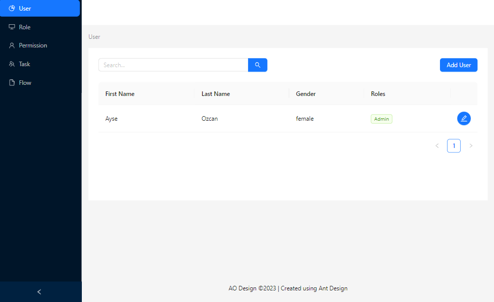
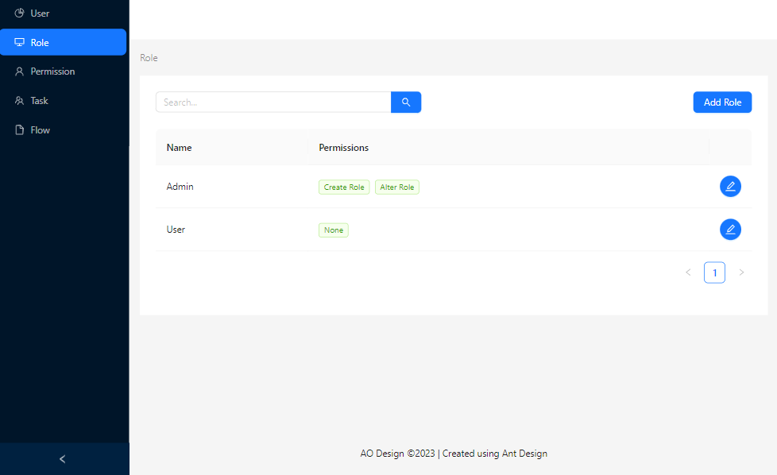
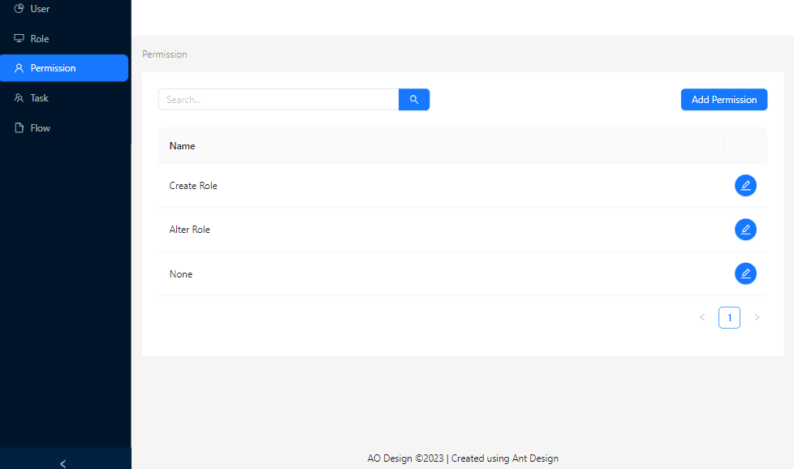
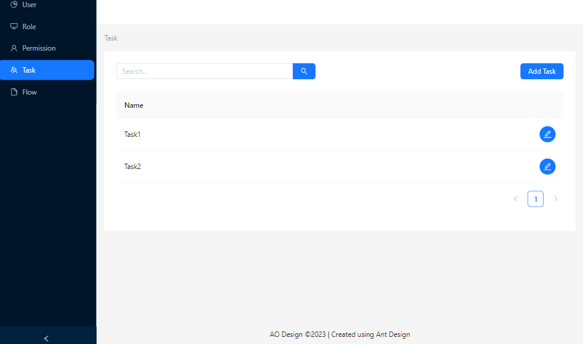
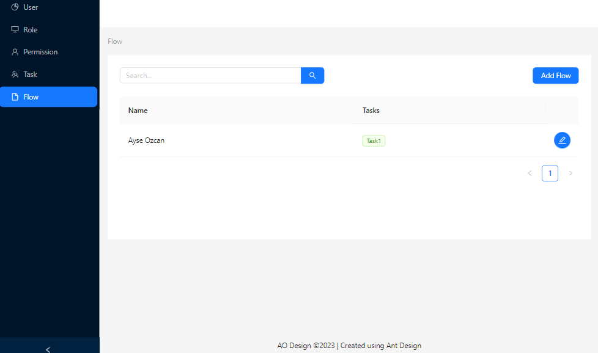

# Console-App

**User**


---

**Role**


---

**Permission**


---

**Task**


---

**Flow**


---

## Getting Started with Create React App

This project was bootstrapped with [Create React App](https://github.com/facebook/create-react-app).

```
npx create-react-app my-app
```

```
cd my-app
```

```
npm start
```

Runs the app in the development mode.\
Open [http://localhost:3000](http://localhost:3000) to view it in your browser.

The page will reload when you make changes.\
You may also see any lint errors in the console.

## Other Scripts

- json server

```
npx json-server --watch db.json --port 5000
```

Open [http://localhost:5000](http://localhost:5000) to view it in your browser.

- axios

```
npm install axios
```

Axios Component for React with child function callback. This is intended to allow in render async requests.

- react-router

```
 npm install react-router-dom
```

This will enable client side routing for our web app.

- sass

```
npm install sass
```

In the project's folder, rename App.css and index.css to App.scss and index.scss, respectively.

After you've renamed those files, you need to update the imports in your App.js and index.js files to match the new file extensions as follows:

```
import "./index.scss";
import "./App.scss";
```

- antd

```
npm install antd
```

React UI library antd that contains a set of high quality components and demos for building rich, interactive user interfaces. [Ant Design](https://ant.design/docs/react/introduce)

## Learn More

You can learn more in the [Create React App documentation](https://facebook.github.io/create-react-app/docs/getting-started).

To learn React, check out the [React documentation](https://reactjs.org/).
